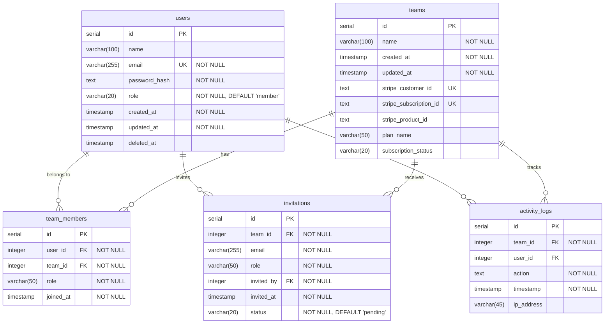

# Database Schema

このドキュメントは、プロジェクトのデータベース構造を可視化したものです。

## Entity Relationship Diagram

## テーブル説明

### users

ユーザー情報を管理するテーブル。認証情報とプロファイルを保存します。

- **主キー**: `id`
- **ユニークキー**: `email`
- **ソフトデリート**: `deleted_at`を使用

### teams

チーム/組織情報を管理するテーブル。Stripe連携情報も含みます。

- **主キー**: `id`
- **Stripe統合**: 顧客ID、サブスクリプションID、製品IDを保存

### team_members

ユーザーとチームの中間テーブル。多対多の関係を実現します。

- **主キー**: `id`
- **外部キー**: `user_id` → users.id, `team_id` → teams.id

### activity_logs

チームとユーザーのアクティビティを記録するテーブル。

- **主キー**: `id`
- **外部キー**: `team_id` → teams.id, `user_id` → users.id (nullable)
- **用途**: 監査ログ、セキュリティ追跡

### invitations

チームへの招待を管理するテーブル。

- **主キー**: `id`
- **外部キー**: `team_id` → teams.id, `invited_by` → users.id
- **ステータス**: pending (デフォルト)

## Activity Types

アプリケーションで追跡される主なアクティビティタイプ:

- `SIGN_UP`: ユーザー登録
- `SIGN_IN`: ログイン
- `SIGN_OUT`: ログアウト
- `UPDATE_PASSWORD`: パスワード更新
- `DELETE_ACCOUNT`: アカウント削除
- `UPDATE_ACCOUNT`: アカウント情報更新
- `CREATE_TEAM`: チーム作成
- `REMOVE_TEAM_MEMBER`: メンバー削除
- `INVITE_TEAM_MEMBER`: メンバー招待
- `ACCEPT_INVITATION`: 招待承認
